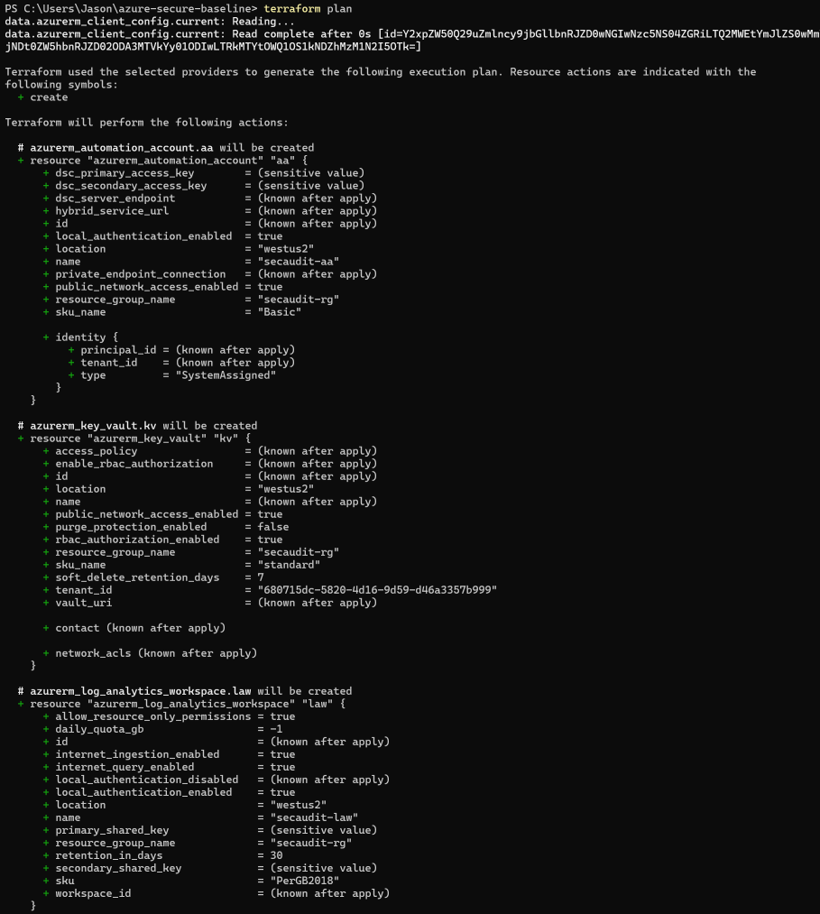
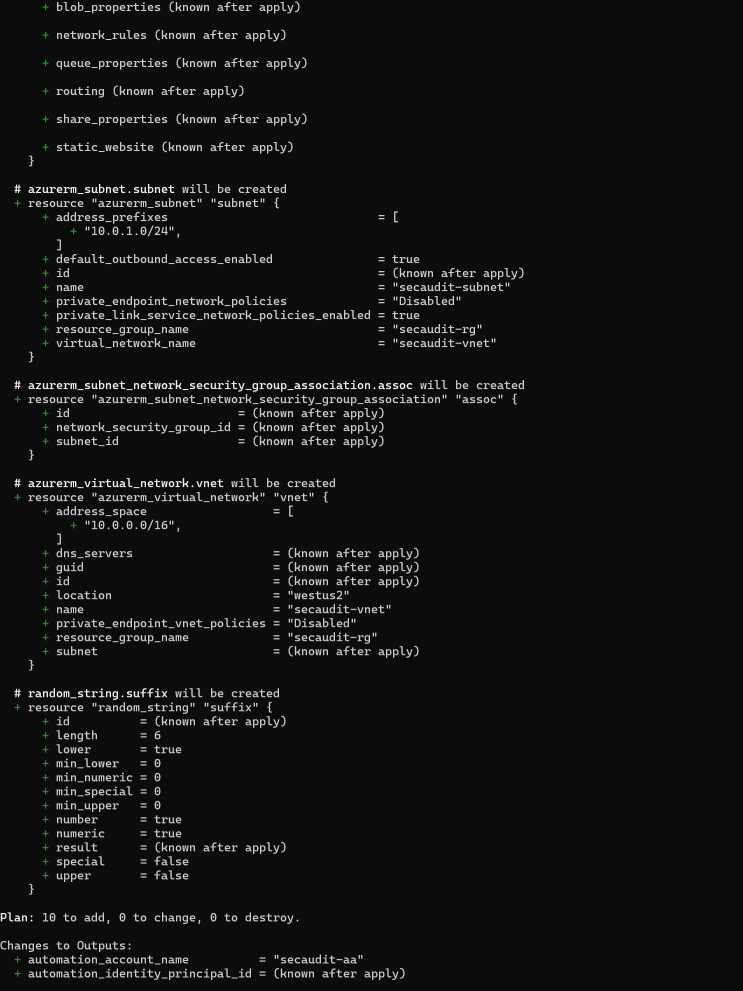
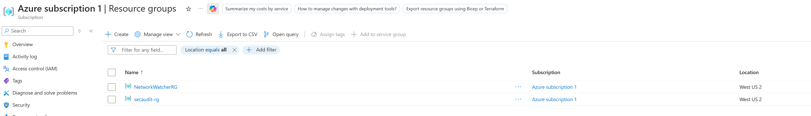
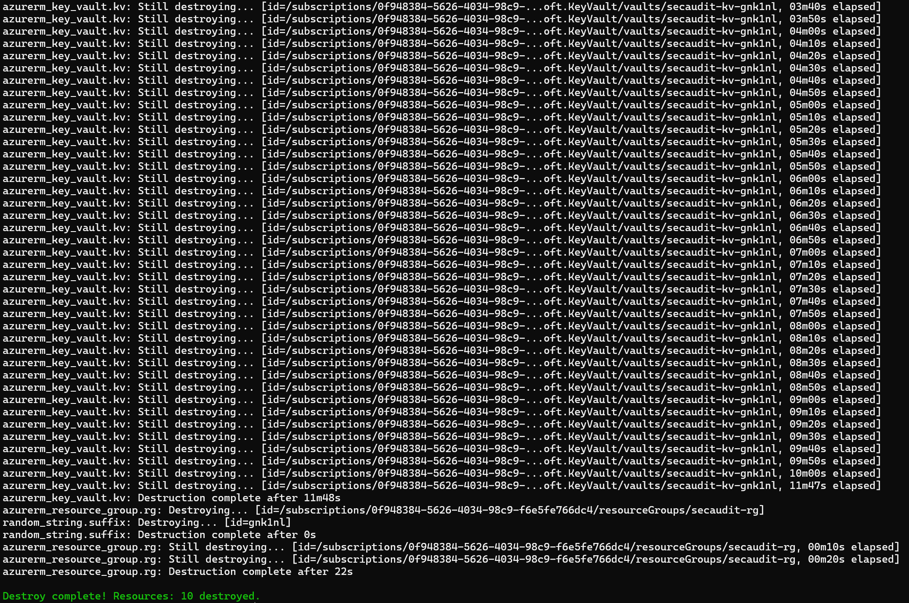

# Secure Azure Baseline (Terraform)

A small Azure environment defined entirely as code — built secure by default:
deny-by-default networking, no public storage, an RBAC-governed Key Vault,
central logging, and a least-privilege automation identity. The whole thing
stands up with `terraform apply` and tears down with `terraform destroy`.

Companion to my [Entra ID & Intune Security Posture Auditor](https://github.com/JaBruni/entra-posture-auditor) —
the Automation account provisioned here is the planned home for running that
auditor on a weekly schedule.

## Security Decisions

The point of this repo isn't the resource list — it's that every resource ships
with a security posture, written down as code:

- **Deny-by-default networking.** The NSG blocks all inbound traffic. Nothing
  is reachable unless a rule is intentionally added.
- **Storage is off the public internet.** `public_network_access_enabled = false`,
  HTTPS-only, TLS 1.2 minimum, and no public blob containers allowed.
- **Key Vault uses RBAC, not access policies.** Access is governed by Azure
  role assignments — one consistent permission model instead of a side list.
  Soft-delete is on; purge protection is off here only so teardown stays clean
  (it should be on in production).
- **Central logging exists from day one.** A Log Analytics workspace with
  30-day retention, so diagnostics have somewhere to go.
- **No stored credentials.** The Automation account uses a system-assigned
  managed identity — Azure manages the credential, so there is no secret or
  certificate to store, leak, or rotate.

## Architecture

```
Terraform  ──deploys──►  Resource Group
                          ├── Log Analytics Workspace      (central logging, 30-day retention)
                          ├── Virtual Network + Subnet
                          │     └── Network Security Group  (deny-by-default)
                          ├── Storage Account              (no public access, TLS 1.2, HTTPS-only)
                          ├── Key Vault                    (RBAC, soft-delete)
                          └── Automation Account           (system-assigned managed identity)
```

## Deployed / Destroyed

| | |
|---|---|
| Plan |   |
| Deployed |  |
| Destroyed |  |

## Usage

Prereqs: Terraform, Azure CLI, an Azure subscription.

```powershell
az login
az account set --subscription "<your-subscription-id>"

# copy the example and fill in your subscription ID
cp terraform.tfvars.example terraform.tfvars

terraform init
terraform fmt
terraform validate
terraform plan      # read this — it lists exactly what will be created
terraform apply
```

When you're done:

```powershell
terraform destroy
```

State files and `terraform.tfvars` are git-ignored — state can contain
sensitive values and should never be committed.

## Notes from Building

- The azurerm provider v4 requires `subscription_id` explicitly in the
  provider block — older tutorials skip it and fail on `plan`.
- `enable_rbac_authorization` on Key Vault is deprecated in v4; migrated to
  `rbac_authorization_enabled` after `terraform validate` flagged it
  (removed in v5).

## Future Enhancements

- Deploy the posture auditor as a scheduled PowerShell 7.2 runbook using the
  Automation account's managed identity with least-privilege Graph roles
- Remote state in an Azure Storage backend with state locking
- Azure Policy assignments for continuous compliance checking

## Skills Demonstrated

Terraform / Infrastructure as Code · Azure (networking, storage, Key Vault,
Log Analytics, Automation) · Managed identities · Least-privilege design ·
Secure-by-default configuration
